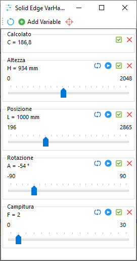

# SolidEdge-VarHandler

Inspired by a post on Siemens Community I decided to create this control center to easily evaluate variables range values

The actual version is limited and will perhaps be expanded per user requests

Feature list:
- Add any user variables
- Minimum and Maximum range retrieved from the variable table (if available)
- Ability to vary Minimum and Maximum range from the user interface (click on values to prompt)
- Exposed name retrieved from the variable table (if available)
- Ability to vary Exposed name from the variable table (double click on the title to prompt)
- Checkbox to auto retrieve the variable on reload
- Remove button
- Reload button
- Taskbar to easily change values
- ReadOnly variables supported
- Works on any Solid Edge environment (par, psm, asm, dft)

Known limits:
- Only user variables supported
- mm, degree, and scalar units supported, other units will result in unpredicted values

An example assembly is provided [here](./Crane.zip)

