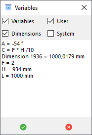

# SolidEdge-VarHandler

Inspired by a post on Siemens Community I decided to create this control center to easily evaluate variables range values

The actual version is limited and will perhaps be expanded per user requests

**Feature list:**
- Add any system or user variables and dimensions 
- Minimum and Maximum range retrieved from the variable table (if available)
- Ability to vary Minimum and Maximum range from the user interface (click on values to prompt)
- Exposed name retrieved from the variable table (if available)
- Ability to vary Exposed name from the variable table (double click on the title to prompt)
- Checkbox to auto-retrieve the variable on reload (**Autotune** on comments field) 
- Remove button 
- Play button, the trackbar will move to the end 
- Loop button, the trackbar will move from one end to the other and reverse continuously 
- Settings button to select the number of steps to perform on play 
- Reload button 
- Export results to excel when play a variable 
- Point tracker, return the coordinate of a 3D coordinate system or a 2D block 
- Taskbar to easily change values
- Manuale vary the value (click on value to prompt)
- ReadOnly variables supported
- Works on any Solid Edge environment (par, psm, asm, dft)

Release versions [here](https://github.com/farfilli/SolidEdge-VarHandler/releases):
- 0.1 Very initial and rude one
- 0.2 Better error handling, variable selector and stay on top
- 0.3 Decimal support for initial value, Play button, Loop button, Stay on top, Manual value edit
- 0.4 Support for System and User Variable and Dimensions, export results to excel, settings button
- 0.5 Correctly handled the range values, enabled 2D\3D tracker
  
**Known limits:**
- ~~Only user variables supported~~
- mm, degree, and scalar units supported, other units will result in unpredicted values

Video in action [here](https://www.youtube.com/watch?v=krcpQPdgGos&t=3s&ab_channel=FrancescoArfilli)

**User UI:**

An example assembly is provided [here](./Crane.zip)

Exported results in excel after play

